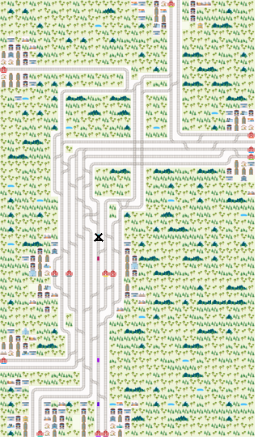

# Flatland scenarios

Collection of scenarios for [Flatland](https://github.com/flatland-association/flatland-rl).

## Scenario Olten



This scenario provides a real-world railway network and timetable centering around the train station hub Olten (Switzerland).
It comes with a mapping of cells `(row,column)` with railway elements to geo-positions (lat,lon):


It allows to visualize train positions on a map:


In addition to being a projection of a real setting, this scenario enables the exploration of maximum capacity, tighter schedules and other optimizations around
the hub.

The scenario also includes a disrupted version of the network where one line is blocked.

The scenario also shows how integrate with [InteractiveAI](https://github.com/AI4REALNET/InteractiveAI), which allows to visualize context and events of the
scenario:


* **context** (`Map` view) shows the current train positions
* **events** (`Notifications` view) alerts when trains have a malfunction
* **historic** (`Timeline` view) shows the history of train malfunctions and their duration

The simulation can be run at different simulation time to real-time ratios.

🎞️ Have a look a the [video](./scenario_olten/img/olten_thumb.mp4).

## Trajectories

Trajectories are scenario traces collecting a policy's action and the agent's position etc. for benchmarking and regression testing.

### Prepare new version

```
cd trajectories
VERSION="_v3"
zip -r FLATLAND_BENCHMARK_EPISODES_FOLDER${VERSION}.zip 30x30\ map -x "*.DS_Store"
zip -r FLATLAND_BENCHMARK_EPISODES_FOLDER${VERSION}.zip malfunction_deadlock_avoidance_heuristics -x "*.DS_Store"
```

### Changelog

| Version                                                                                                          | Description                                                                                                                        |
|------------------------------------------------------------------------------------------------------------------|------------------------------------------------------------------------------------------------------------------------------------|
| [v3](https://github.com/flatland-association/flatland-scenarios/commit/a90661093e1b7d365bc81c6bc020ac9906bb548d) | [Re-generate malfunction scenarios after bugfixing of step function](https://github.com/flatland-association/flatland-rl/pull/171) |
| [v2](https://github.com/flatland-association/flatland-scenarios/commit/8ee8ff8cd2ca71645ab89684f97f7f33a3762e09) | [Add scenarios with malfunction](https://github.com/flatland-association/flatland-rl/pull/131/)                                    |
| [v1](https://github.com/flatland-association/flatland-scenarios/commit/2067fd20c4c740b126cf6605b6c4770f6c37552f) | [Initial version without malfunction](https://github.com/flatland-association/flatland-rl/pull/105)                                |
