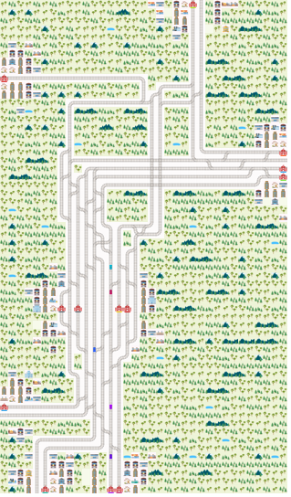
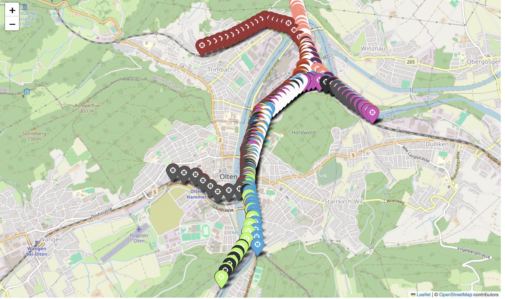
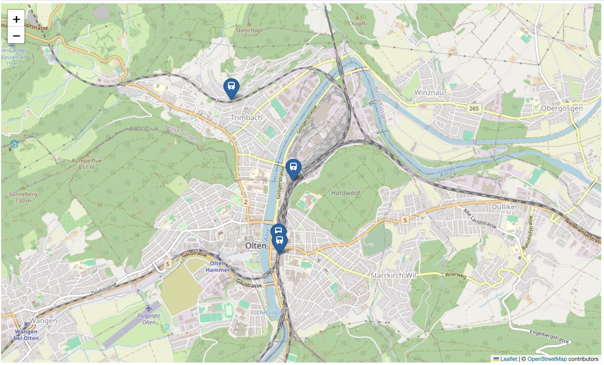

# Flatland scenarios

Collection of scenarios for [Flatland](https://github.com/flatland-association/flatland-rl).

### ToC

| description                                  |
|----------------------------------------------|
| [`scenario_olten`](#scenario-olten)          |
| [`scenarios`](#scenarios-randomly-generated) |
| [`trajectories`](#Trajectories)              |

## Scenario Olten



This scenario provides a real-world railway network and timetable centering around the train station hub Olten (Switzerland).
It comes with a mapping of cells `(row,column)` with railway elements to geo-positions (lat,lon):



It allows to visualize train positions on a map:



In addition to being a projection of a real setting, this scenario enables the exploration of maximum capacity, tighter schedules and other optimizations around
the hub.

The scenario also includes a disrupted version of the network where one line is blocked.

The scenario also shows how integrate with [InteractiveAI](https://github.com/AI4REALNET/InteractiveAI), which allows to visualize context and events of the
scenario:


* **context** (`Map` view) shows the current train positions
* **events** (`Notifications` view) alerts when trains have a malfunction
* **historic** (`Timeline` view) shows the history of train malfunctions and their duration

The simulation can be run at different simulation time to real-time ratios.

### 🎞️ Have a look a the Vidoes

#### InteractiveAI Integration Scenario Olten

<video alt="InteractiveAI Integration Scenario Olten" src='https://github.com/user-attachments/assets/1f103db3-7b40-4b84-b928-1a227569b11c' width="180"></video>

#### Scenario Olten

<video alt="Scenario Olten" src="https://github.com/user-attachments/assets/35f3933d-266a-405c-a411-3233d94782ed" width="180"></video>

#### Scenario Olten Disrupted

Blocked line:

<video alt="Scenario Olten Disrupted" src="https://github.com/user-attachments/assets/15c4c746-ca92-43d8-be77-7650cbbb75df" width="180"></video>

#### Scenario Olten Partially Closed

Only 3/10 lines open:
<video alt="Scenario Olten Partially Closed" src="https://github.com/user-attachments/assets/262f36c6-155a-4a28-8b1f-ec8dcaa05b76" width="180"></video>

### Changelog

| Version | Description          |
|---------|----------------------|
| v2      | Generated with 4.1.0 |
| v1      | Generated with 4.0.6 |

## Scenarios (randomly generated)

The zip file is created by

```bash
python scenarios/gen_envs.py
```

This is the same approach as in [Flatland Benchmarks](https://github.com/flatland-association/flatland-benchmarks/blob/main/benchmarks/flatland3/gen_envs.py).

The configurations are taken from [metadata.csv](scenarios/metadata.csv):

|     | test_id | env_id  | n_agents | x_dim | y_dim | n_cities | max_rail_pairs_in_city | n_envs_run | seed | grid_mode | max_rails_between_cities | malfunction_duration_min | malfunction_duration_max | malfunction_interval | speed_ratios                                   |
|----:|:--------|:--------|---------:|------:|------:|---------:|-----------------------:|-----------:|-----:|:----------|-------------------------:|-------------------------:|-------------------------:|---------------------:|:-----------------------------------------------|
|   0 | Test_00 | Level_0 |        7 |    30 |    30 |        2 |                      2 |         10 |   42 | False     |                        2 |                       20 |                       50 |                  540 | {1.0: 0.25, 0.5: 0.25, 0.33: 0.25, 0.25: 0.25} |
|   1 | Test_00 | Level_1 |        7 |    30 |    30 |        2 |                      2 |         10 |   43 | False     |                        2 |                       20 |                       50 |                  540 | {1.0: 0.25, 0.5: 0.25, 0.33: 0.25, 0.25: 0.25} |
|   2 | Test_00 | Level_2 |        7 |    30 |    30 |        2 |                      2 |         10 |   44 | False     |                        2 |                       20 |                       50 |                  540 | {1.0: 0.25, 0.5: 0.25, 0.33: 0.25, 0.25: 0.25} |
|   3 | Test_00 | Level_3 |        7 |    30 |    30 |        2 |                      2 |         10 |   45 | False     |                        2 |                       20 |                       50 |                  540 | {1.0: 0.25, 0.5: 0.25, 0.33: 0.25, 0.25: 0.25} |
|   4 | Test_00 | Level_4 |        7 |    30 |    30 |        2 |                      2 |         10 |   46 | False     |                        2 |                       20 |                       50 |                  540 | {1.0: 0.25, 0.5: 0.25, 0.33: 0.25, 0.25: 0.25} |
|   5 | Test_00 | Level_5 |        7 |    30 |    30 |        2 |                      2 |         10 |   47 | False     |                        2 |                       20 |                       50 |                  540 | {1.0: 0.25, 0.5: 0.25, 0.33: 0.25, 0.25: 0.25} |
|   6 | Test_00 | Level_6 |        7 |    30 |    30 |        2 |                      2 |         10 |   48 | False     |                        2 |                       20 |                       50 |                  540 | {1.0: 0.25, 0.5: 0.25, 0.33: 0.25, 0.25: 0.25} |
|   7 | Test_00 | Level_7 |        7 |    30 |    30 |        2 |                      2 |         10 |   49 | False     |                        2 |                       20 |                       50 |                  540 | {1.0: 0.25, 0.5: 0.25, 0.33: 0.25, 0.25: 0.25} |
|   8 | Test_00 | Level_8 |        7 |    30 |    30 |        2 |                      2 |         10 |   50 | False     |                        2 |                       20 |                       50 |                  540 | {1.0: 0.25, 0.5: 0.25, 0.33: 0.25, 0.25: 0.25} |
|   9 | Test_00 | Level_9 |        7 |    30 |    30 |        2 |                      2 |         10 |   51 | False     |                        2 |                       20 |                       50 |                  540 | {1.0: 0.25, 0.5: 0.25, 0.33: 0.25, 0.25: 0.25} |
|  10 | Test_01 | Level_0 |        7 |    30 |    30 |        2 |                      2 |         10 |   42 | False     |                        2 |                       20 |                       50 |                  540 | {1.0: 0.25, 0.5: 0.25, 0.33: 0.25, 0.25: 0.25} |
|  11 | Test_01 | Level_1 |        7 |    30 |    30 |        2 |                      2 |         10 |   43 | False     |                        2 |                       20 |                       50 |                  540 | {1.0: 0.25, 0.5: 0.25, 0.33: 0.25, 0.25: 0.25} |
|  12 | Test_01 | Level_2 |        7 |    30 |    30 |        2 |                      2 |         10 |   44 | False     |                        2 |                       20 |                       50 |                  540 | {1.0: 0.25, 0.5: 0.25, 0.33: 0.25, 0.25: 0.25} |
|  13 | Test_01 | Level_3 |        7 |    30 |    30 |        2 |                      2 |         10 |   45 | False     |                        2 |                       20 |                       50 |                  540 | {1.0: 0.25, 0.5: 0.25, 0.33: 0.25, 0.25: 0.25} |
|  14 | Test_01 | Level_4 |        7 |    30 |    30 |        2 |                      2 |         10 |   46 | False     |                        2 |                       20 |                       50 |                  540 | {1.0: 0.25, 0.5: 0.25, 0.33: 0.25, 0.25: 0.25} |
|  15 | Test_01 | Level_5 |        7 |    30 |    30 |        2 |                      2 |         10 |   47 | False     |                        2 |                       20 |                       50 |                  540 | {1.0: 0.25, 0.5: 0.25, 0.33: 0.25, 0.25: 0.25} |
|  16 | Test_01 | Level_6 |        7 |    30 |    30 |        2 |                      2 |         10 |   48 | False     |                        2 |                       20 |                       50 |                  540 | {1.0: 0.25, 0.5: 0.25, 0.33: 0.25, 0.25: 0.25} |
|  17 | Test_01 | Level_7 |        7 |    30 |    30 |        2 |                      2 |         10 |   49 | False     |                        2 |                       20 |                       50 |                  540 | {1.0: 0.25, 0.5: 0.25, 0.33: 0.25, 0.25: 0.25} |
|  18 | Test_01 | Level_8 |        7 |    30 |    30 |        2 |                      2 |         10 |   50 | False     |                        2 |                       20 |                       50 |                  540 | {1.0: 0.25, 0.5: 0.25, 0.33: 0.25, 0.25: 0.25} |
|  19 | Test_01 | Level_9 |        7 |    30 |    30 |        2 |                      2 |         10 |   51 | False     |                        2 |                       20 |                       50 |                  540 | {1.0: 0.25, 0.5: 0.25, 0.33: 0.25, 0.25: 0.25} |
|  20 | Test_02 | Level_0 |       20 |    30 |    30 |        3 |                      2 |         10 |   42 | False     |                        2 |                       20 |                       50 |                  540 | {1.0: 0.25, 0.5: 0.25, 0.33: 0.25, 0.25: 0.25} |
|  21 | Test_02 | Level_1 |       20 |    30 |    30 |        3 |                      2 |         10 |   43 | False     |                        2 |                       20 |                       50 |                  540 | {1.0: 0.25, 0.5: 0.25, 0.33: 0.25, 0.25: 0.25} |
|  22 | Test_02 | Level_2 |       20 |    30 |    30 |        3 |                      2 |         10 |   44 | False     |                        2 |                       20 |                       50 |                  540 | {1.0: 0.25, 0.5: 0.25, 0.33: 0.25, 0.25: 0.25} |
|  23 | Test_02 | Level_3 |       20 |    30 |    30 |        3 |                      2 |         10 |   45 | False     |                        2 |                       20 |                       50 |                  540 | {1.0: 0.25, 0.5: 0.25, 0.33: 0.25, 0.25: 0.25} |
|  24 | Test_02 | Level_4 |       20 |    30 |    30 |        3 |                      2 |         10 |   46 | False     |                        2 |                       20 |                       50 |                  540 | {1.0: 0.25, 0.5: 0.25, 0.33: 0.25, 0.25: 0.25} |
|  25 | Test_02 | Level_5 |       20 |    30 |    30 |        3 |                      2 |         10 |   47 | False     |                        2 |                       20 |                       50 |                  540 | {1.0: 0.25, 0.5: 0.25, 0.33: 0.25, 0.25: 0.25} |
|  26 | Test_02 | Level_6 |       20 |    30 |    30 |        3 |                      2 |         10 |   48 | False     |                        2 |                       20 |                       50 |                  540 | {1.0: 0.25, 0.5: 0.25, 0.33: 0.25, 0.25: 0.25} |
|  27 | Test_02 | Level_7 |       20 |    30 |    30 |        3 |                      2 |         10 |   49 | False     |                        2 |                       20 |                       50 |                  540 | {1.0: 0.25, 0.5: 0.25, 0.33: 0.25, 0.25: 0.25} |
|  28 | Test_02 | Level_8 |       20 |    30 |    30 |        3 |                      2 |         10 |   50 | False     |                        2 |                       20 |                       50 |                  540 | {1.0: 0.25, 0.5: 0.25, 0.33: 0.25, 0.25: 0.25} |
|  29 | Test_02 | Level_9 |       20 |    30 |    30 |        3 |                      2 |         10 |   51 | False     |                        2 |                       20 |                       50 |                  540 | {1.0: 0.25, 0.5: 0.25, 0.33: 0.25, 0.25: 0.25} |
|  30 | Test_03 | Level_0 |       50 |    30 |    35 |        3 |                      2 |         10 |   42 | False     |                        2 |                       20 |                       50 |                  540 | {1.0: 0.25, 0.5: 0.25, 0.33: 0.25, 0.25: 0.25} |
|  31 | Test_03 | Level_1 |       50 |    30 |    35 |        3 |                      2 |         10 |   43 | False     |                        2 |                       20 |                       50 |                  540 | {1.0: 0.25, 0.5: 0.25, 0.33: 0.25, 0.25: 0.25} |
|  32 | Test_03 | Level_2 |       50 |    30 |    35 |        3 |                      2 |         10 |   44 | False     |                        2 |                       20 |                       50 |                  540 | {1.0: 0.25, 0.5: 0.25, 0.33: 0.25, 0.25: 0.25} |
|  33 | Test_03 | Level_3 |       50 |    30 |    35 |        3 |                      2 |         10 |   45 | False     |                        2 |                       20 |                       50 |                  540 | {1.0: 0.25, 0.5: 0.25, 0.33: 0.25, 0.25: 0.25} |
|  34 | Test_03 | Level_4 |       50 |    30 |    35 |        3 |                      2 |         10 |   46 | False     |                        2 |                       20 |                       50 |                  540 | {1.0: 0.25, 0.5: 0.25, 0.33: 0.25, 0.25: 0.25} |
|  35 | Test_03 | Level_5 |       50 |    30 |    35 |        3 |                      2 |         10 |   47 | False     |                        2 |                       20 |                       50 |                  540 | {1.0: 0.25, 0.5: 0.25, 0.33: 0.25, 0.25: 0.25} |
|  36 | Test_03 | Level_6 |       50 |    30 |    35 |        3 |                      2 |         10 |   48 | False     |                        2 |                       20 |                       50 |                  540 | {1.0: 0.25, 0.5: 0.25, 0.33: 0.25, 0.25: 0.25} |
|  37 | Test_03 | Level_7 |       50 |    30 |    35 |        3 |                      2 |         10 |   49 | False     |                        2 |                       20 |                       50 |                  540 | {1.0: 0.25, 0.5: 0.25, 0.33: 0.25, 0.25: 0.25} |
|  38 | Test_03 | Level_8 |       50 |    30 |    35 |        3 |                      2 |         10 |   50 | False     |                        2 |                       20 |                       50 |                  540 | {1.0: 0.25, 0.5: 0.25, 0.33: 0.25, 0.25: 0.25} |
|  39 | Test_03 | Level_9 |       50 |    30 |    35 |        3 |                      2 |         10 |   51 | False     |                        2 |                       20 |                       50 |                  540 | {1.0: 0.25, 0.5: 0.25, 0.33: 0.25, 0.25: 0.25} |
|  40 | Test_04 | Level_0 |       80 |    35 |    30 |        5 |                      2 |         10 |   42 | False     |                        2 |                       20 |                       50 |                  540 | {1.0: 0.25, 0.5: 0.25, 0.33: 0.25, 0.25: 0.25} |
|  41 | Test_04 | Level_1 |       80 |    35 |    30 |        5 |                      2 |         10 |   43 | False     |                        2 |                       20 |                       50 |                  540 | {1.0: 0.25, 0.5: 0.25, 0.33: 0.25, 0.25: 0.25} |
|  42 | Test_04 | Level_2 |       80 |    35 |    30 |        5 |                      2 |         10 |   44 | False     |                        2 |                       20 |                       50 |                  540 | {1.0: 0.25, 0.5: 0.25, 0.33: 0.25, 0.25: 0.25} |
|  43 | Test_04 | Level_3 |       80 |    35 |    30 |        5 |                      2 |         10 |   45 | False     |                        2 |                       20 |                       50 |                  540 | {1.0: 0.25, 0.5: 0.25, 0.33: 0.25, 0.25: 0.25} |
|  44 | Test_04 | Level_4 |       80 |    35 |    30 |        5 |                      2 |         10 |   46 | False     |                        2 |                       20 |                       50 |                  540 | {1.0: 0.25, 0.5: 0.25, 0.33: 0.25, 0.25: 0.25} |
|  45 | Test_04 | Level_5 |       80 |    35 |    30 |        5 |                      2 |         10 |   47 | False     |                        2 |                       20 |                       50 |                  540 | {1.0: 0.25, 0.5: 0.25, 0.33: 0.25, 0.25: 0.25} |
|  46 | Test_04 | Level_6 |       80 |    35 |    30 |        5 |                      2 |         10 |   48 | False     |                        2 |                       20 |                       50 |                  540 | {1.0: 0.25, 0.5: 0.25, 0.33: 0.25, 0.25: 0.25} |
|  47 | Test_04 | Level_7 |       80 |    35 |    30 |        5 |                      2 |         10 |   49 | False     |                        2 |                       20 |                       50 |                  540 | {1.0: 0.25, 0.5: 0.25, 0.33: 0.25, 0.25: 0.25} |
|  48 | Test_04 | Level_8 |       80 |    35 |    30 |        5 |                      2 |         10 |   50 | False     |                        2 |                       20 |                       50 |                  540 | {1.0: 0.25, 0.5: 0.25, 0.33: 0.25, 0.25: 0.25} |
|  49 | Test_04 | Level_9 |       80 |    35 |    30 |        5 |                      2 |         10 |   51 | False     |                        2 |                       20 |                       50 |                  540 | {1.0: 0.25, 0.5: 0.25, 0.33: 0.25, 0.25: 0.25} |
|  50 | Test_05 | Level_0 |       80 |    45 |    35 |        7 |                      2 |         10 |   42 | False     |                        2 |                       20 |                       50 |                  540 | {1.0: 0.25, 0.5: 0.25, 0.33: 0.25, 0.25: 0.25} |
|  51 | Test_05 | Level_1 |       80 |    45 |    35 |        7 |                      2 |         10 |   43 | False     |                        2 |                       20 |                       50 |                  540 | {1.0: 0.25, 0.5: 0.25, 0.33: 0.25, 0.25: 0.25} |
|  52 | Test_05 | Level_2 |       80 |    45 |    35 |        7 |                      2 |         10 |   44 | False     |                        2 |                       20 |                       50 |                  540 | {1.0: 0.25, 0.5: 0.25, 0.33: 0.25, 0.25: 0.25} |
|  53 | Test_05 | Level_3 |       80 |    45 |    35 |        7 |                      2 |         10 |   45 | False     |                        2 |                       20 |                       50 |                  540 | {1.0: 0.25, 0.5: 0.25, 0.33: 0.25, 0.25: 0.25} |
|  54 | Test_05 | Level_4 |       80 |    45 |    35 |        7 |                      2 |         10 |   46 | False     |                        2 |                       20 |                       50 |                  540 | {1.0: 0.25, 0.5: 0.25, 0.33: 0.25, 0.25: 0.25} |
|  55 | Test_05 | Level_5 |       80 |    45 |    35 |        7 |                      2 |         10 |   47 | False     |                        2 |                       20 |                       50 |                  540 | {1.0: 0.25, 0.5: 0.25, 0.33: 0.25, 0.25: 0.25} |
|  56 | Test_05 | Level_6 |       80 |    45 |    35 |        7 |                      2 |         10 |   48 | False     |                        2 |                       20 |                       50 |                  540 | {1.0: 0.25, 0.5: 0.25, 0.33: 0.25, 0.25: 0.25} |
|  57 | Test_05 | Level_7 |       80 |    45 |    35 |        7 |                      2 |         10 |   49 | False     |                        2 |                       20 |                       50 |                  540 | {1.0: 0.25, 0.5: 0.25, 0.33: 0.25, 0.25: 0.25} |
|  58 | Test_05 | Level_8 |       80 |    45 |    35 |        7 |                      2 |         10 |   50 | False     |                        2 |                       20 |                       50 |                  540 | {1.0: 0.25, 0.5: 0.25, 0.33: 0.25, 0.25: 0.25} |
|  59 | Test_05 | Level_9 |       80 |    45 |    35 |        7 |                      2 |         10 |   51 | False     |                        2 |                       20 |                       50 |                  540 | {1.0: 0.25, 0.5: 0.25, 0.33: 0.25, 0.25: 0.25} |
|  60 | Test_06 | Level_0 |       80 |    40 |    60 |        9 |                      2 |         10 |   42 | False     |                        2 |                       20 |                       50 |                  540 | {1.0: 0.25, 0.5: 0.25, 0.33: 0.25, 0.25: 0.25} |
|  61 | Test_06 | Level_1 |       80 |    40 |    60 |        9 |                      2 |         10 |   43 | False     |                        2 |                       20 |                       50 |                  540 | {1.0: 0.25, 0.5: 0.25, 0.33: 0.25, 0.25: 0.25} |
|  62 | Test_06 | Level_2 |       80 |    40 |    60 |        9 |                      2 |         10 |   44 | False     |                        2 |                       20 |                       50 |                  540 | {1.0: 0.25, 0.5: 0.25, 0.33: 0.25, 0.25: 0.25} |
|  63 | Test_06 | Level_3 |       80 |    40 |    60 |        9 |                      2 |         10 |   45 | False     |                        2 |                       20 |                       50 |                  540 | {1.0: 0.25, 0.5: 0.25, 0.33: 0.25, 0.25: 0.25} |
|  64 | Test_06 | Level_4 |       80 |    40 |    60 |        9 |                      2 |         10 |   46 | False     |                        2 |                       20 |                       50 |                  540 | {1.0: 0.25, 0.5: 0.25, 0.33: 0.25, 0.25: 0.25} |
|  65 | Test_06 | Level_5 |       80 |    40 |    60 |        9 |                      2 |         10 |   47 | False     |                        2 |                       20 |                       50 |                  540 | {1.0: 0.25, 0.5: 0.25, 0.33: 0.25, 0.25: 0.25} |
|  66 | Test_06 | Level_6 |       80 |    40 |    60 |        9 |                      2 |         10 |   48 | False     |                        2 |                       20 |                       50 |                  540 | {1.0: 0.25, 0.5: 0.25, 0.33: 0.25, 0.25: 0.25} |
|  67 | Test_06 | Level_7 |       80 |    40 |    60 |        9 |                      2 |         10 |   49 | False     |                        2 |                       20 |                       50 |                  540 | {1.0: 0.25, 0.5: 0.25, 0.33: 0.25, 0.25: 0.25} |
|  68 | Test_06 | Level_8 |       80 |    40 |    60 |        9 |                      2 |         10 |   50 | False     |                        2 |                       20 |                       50 |                  540 | {1.0: 0.25, 0.5: 0.25, 0.33: 0.25, 0.25: 0.25} |
|  69 | Test_06 | Level_9 |       80 |    40 |    60 |        9 |                      2 |         10 |   51 | False     |                        2 |                       20 |                       50 |                  540 | {1.0: 0.25, 0.5: 0.25, 0.33: 0.25, 0.25: 0.25} |
|  70 | Test_07 | Level_0 |       80 |    60 |    40 |       13 |                      2 |         10 |   42 | False     |                        2 |                       20 |                       50 |                  540 | {1.0: 0.25, 0.5: 0.25, 0.33: 0.25, 0.25: 0.25} |
|  71 | Test_07 | Level_1 |       80 |    60 |    40 |       13 |                      2 |         10 |   43 | False     |                        2 |                       20 |                       50 |                  540 | {1.0: 0.25, 0.5: 0.25, 0.33: 0.25, 0.25: 0.25} |
|  72 | Test_07 | Level_2 |       80 |    60 |    40 |       13 |                      2 |         10 |   44 | False     |                        2 |                       20 |                       50 |                  540 | {1.0: 0.25, 0.5: 0.25, 0.33: 0.25, 0.25: 0.25} |
|  73 | Test_07 | Level_3 |       80 |    60 |    40 |       13 |                      2 |         10 |   45 | False     |                        2 |                       20 |                       50 |                  540 | {1.0: 0.25, 0.5: 0.25, 0.33: 0.25, 0.25: 0.25} |
|  74 | Test_07 | Level_4 |       80 |    60 |    40 |       13 |                      2 |         10 |   46 | False     |                        2 |                       20 |                       50 |                  540 | {1.0: 0.25, 0.5: 0.25, 0.33: 0.25, 0.25: 0.25} |
|  75 | Test_07 | Level_5 |       80 |    60 |    40 |       13 |                      2 |         10 |   47 | False     |                        2 |                       20 |                       50 |                  540 | {1.0: 0.25, 0.5: 0.25, 0.33: 0.25, 0.25: 0.25} |
|  76 | Test_07 | Level_6 |       80 |    60 |    40 |       13 |                      2 |         10 |   48 | False     |                        2 |                       20 |                       50 |                  540 | {1.0: 0.25, 0.5: 0.25, 0.33: 0.25, 0.25: 0.25} |
|  77 | Test_07 | Level_7 |       80 |    60 |    40 |       13 |                      2 |         10 |   49 | False     |                        2 |                       20 |                       50 |                  540 | {1.0: 0.25, 0.5: 0.25, 0.33: 0.25, 0.25: 0.25} |
|  78 | Test_07 | Level_8 |       80 |    60 |    40 |       13 |                      2 |         10 |   50 | False     |                        2 |                       20 |                       50 |                  540 | {1.0: 0.25, 0.5: 0.25, 0.33: 0.25, 0.25: 0.25} |
|  79 | Test_07 | Level_9 |       80 |    60 |    40 |       13 |                      2 |         10 |   51 | False     |                        2 |                       20 |                       50 |                  540 | {1.0: 0.25, 0.5: 0.25, 0.33: 0.25, 0.25: 0.25} |
|  80 | Test_08 | Level_0 |       80 |    60 |    60 |       17 |                      2 |         10 |   42 | False     |                        2 |                       20 |                       50 |                  540 | {1.0: 0.25, 0.5: 0.25, 0.33: 0.25, 0.25: 0.25} |
|  81 | Test_08 | Level_1 |       80 |    60 |    60 |       17 |                      2 |         10 |   43 | False     |                        2 |                       20 |                       50 |                  540 | {1.0: 0.25, 0.5: 0.25, 0.33: 0.25, 0.25: 0.25} |
|  82 | Test_08 | Level_2 |       80 |    60 |    60 |       17 |                      2 |         10 |   44 | False     |                        2 |                       20 |                       50 |                  540 | {1.0: 0.25, 0.5: 0.25, 0.33: 0.25, 0.25: 0.25} |
|  83 | Test_08 | Level_3 |       80 |    60 |    60 |       17 |                      2 |         10 |   45 | False     |                        2 |                       20 |                       50 |                  540 | {1.0: 0.25, 0.5: 0.25, 0.33: 0.25, 0.25: 0.25} |
|  84 | Test_08 | Level_4 |       80 |    60 |    60 |       17 |                      2 |         10 |   46 | False     |                        2 |                       20 |                       50 |                  540 | {1.0: 0.25, 0.5: 0.25, 0.33: 0.25, 0.25: 0.25} |
|  85 | Test_08 | Level_5 |       80 |    60 |    60 |       17 |                      2 |         10 |   47 | False     |                        2 |                       20 |                       50 |                  540 | {1.0: 0.25, 0.5: 0.25, 0.33: 0.25, 0.25: 0.25} |
|  86 | Test_08 | Level_6 |       80 |    60 |    60 |       17 |                      2 |         10 |   48 | False     |                        2 |                       20 |                       50 |                  540 | {1.0: 0.25, 0.5: 0.25, 0.33: 0.25, 0.25: 0.25} |
|  87 | Test_08 | Level_7 |       80 |    60 |    60 |       17 |                      2 |         10 |   49 | False     |                        2 |                       20 |                       50 |                  540 | {1.0: 0.25, 0.5: 0.25, 0.33: 0.25, 0.25: 0.25} |
|  88 | Test_08 | Level_8 |       80 |    60 |    60 |       17 |                      2 |         10 |   50 | False     |                        2 |                       20 |                       50 |                  540 | {1.0: 0.25, 0.5: 0.25, 0.33: 0.25, 0.25: 0.25} |
|  89 | Test_08 | Level_9 |       80 |    60 |    60 |       17 |                      2 |         10 |   51 | False     |                        2 |                       20 |                       50 |                  540 | {1.0: 0.25, 0.5: 0.25, 0.33: 0.25, 0.25: 0.25} |
|  90 | Test_09 | Level_0 |      100 |    80 |   120 |       21 |                      2 |         10 |   42 | False     |                        2 |                       20 |                       50 |                  540 | {1.0: 0.25, 0.5: 0.25, 0.33: 0.25, 0.25: 0.25} |
|  91 | Test_09 | Level_1 |      100 |    80 |   120 |       21 |                      2 |         10 |   43 | False     |                        2 |                       20 |                       50 |                  540 | {1.0: 0.25, 0.5: 0.25, 0.33: 0.25, 0.25: 0.25} |
|  92 | Test_09 | Level_2 |      100 |    80 |   120 |       21 |                      2 |         10 |   44 | False     |                        2 |                       20 |                       50 |                  540 | {1.0: 0.25, 0.5: 0.25, 0.33: 0.25, 0.25: 0.25} |
|  93 | Test_09 | Level_3 |      100 |    80 |   120 |       21 |                      2 |         10 |   45 | False     |                        2 |                       20 |                       50 |                  540 | {1.0: 0.25, 0.5: 0.25, 0.33: 0.25, 0.25: 0.25} |
|  94 | Test_09 | Level_4 |      100 |    80 |   120 |       21 |                      2 |         10 |   46 | False     |                        2 |                       20 |                       50 |                  540 | {1.0: 0.25, 0.5: 0.25, 0.33: 0.25, 0.25: 0.25} |
|  95 | Test_09 | Level_5 |      100 |    80 |   120 |       21 |                      2 |         10 |   47 | False     |                        2 |                       20 |                       50 |                  540 | {1.0: 0.25, 0.5: 0.25, 0.33: 0.25, 0.25: 0.25} |
|  96 | Test_09 | Level_6 |      100 |    80 |   120 |       21 |                      2 |         10 |   48 | False     |                        2 |                       20 |                       50 |                  540 | {1.0: 0.25, 0.5: 0.25, 0.33: 0.25, 0.25: 0.25} |
|  97 | Test_09 | Level_7 |      100 |    80 |   120 |       21 |                      2 |         10 |   49 | False     |                        2 |                       20 |                       50 |                  540 | {1.0: 0.25, 0.5: 0.25, 0.33: 0.25, 0.25: 0.25} |
|  98 | Test_09 | Level_8 |      100 |    80 |   120 |       21 |                      2 |         10 |   50 | False     |                        2 |                       20 |                       50 |                  540 | {1.0: 0.25, 0.5: 0.25, 0.33: 0.25, 0.25: 0.25} |
|  99 | Test_09 | Level_9 |      100 |    80 |   120 |       21 |                      2 |         10 |   51 | False     |                        2 |                       20 |                       50 |                  540 | {1.0: 0.25, 0.5: 0.25, 0.33: 0.25, 0.25: 0.25} |
| 100 | Test_10 | Level_0 |      100 |   100 |    80 |       25 |                      2 |         10 |   42 | False     |                        2 |                       20 |                       50 |                  540 | {1.0: 0.25, 0.5: 0.25, 0.33: 0.25, 0.25: 0.25} |
| 101 | Test_10 | Level_1 |      100 |   100 |    80 |       25 |                      2 |         10 |   43 | False     |                        2 |                       20 |                       50 |                  540 | {1.0: 0.25, 0.5: 0.25, 0.33: 0.25, 0.25: 0.25} |
| 102 | Test_10 | Level_2 |      100 |   100 |    80 |       25 |                      2 |         10 |   44 | False     |                        2 |                       20 |                       50 |                  540 | {1.0: 0.25, 0.5: 0.25, 0.33: 0.25, 0.25: 0.25} |
| 103 | Test_10 | Level_3 |      100 |   100 |    80 |       25 |                      2 |         10 |   45 | False     |                        2 |                       20 |                       50 |                  540 | {1.0: 0.25, 0.5: 0.25, 0.33: 0.25, 0.25: 0.25} |
| 104 | Test_10 | Level_4 |      100 |   100 |    80 |       25 |                      2 |         10 |   46 | False     |                        2 |                       20 |                       50 |                  540 | {1.0: 0.25, 0.5: 0.25, 0.33: 0.25, 0.25: 0.25} |
| 105 | Test_10 | Level_5 |      100 |   100 |    80 |       25 |                      2 |         10 |   47 | False     |                        2 |                       20 |                       50 |                  540 | {1.0: 0.25, 0.5: 0.25, 0.33: 0.25, 0.25: 0.25} |
| 106 | Test_10 | Level_6 |      100 |   100 |    80 |       25 |                      2 |         10 |   48 | False     |                        2 |                       20 |                       50 |                  540 | {1.0: 0.25, 0.5: 0.25, 0.33: 0.25, 0.25: 0.25} |
| 107 | Test_10 | Level_7 |      100 |   100 |    80 |       25 |                      2 |         10 |   49 | False     |                        2 |                       20 |                       50 |                  540 | {1.0: 0.25, 0.5: 0.25, 0.33: 0.25, 0.25: 0.25} |
| 108 | Test_10 | Level_8 |      100 |   100 |    80 |       25 |                      2 |         10 |   50 | False     |                        2 |                       20 |                       50 |                  540 | {1.0: 0.25, 0.5: 0.25, 0.33: 0.25, 0.25: 0.25} |
| 109 | Test_10 | Level_9 |      100 |   100 |    80 |       25 |                      2 |         10 |   51 | False     |                        2 |                       20 |                       50 |                  540 | {1.0: 0.25, 0.5: 0.25, 0.33: 0.25, 0.25: 0.25} |
| 110 | Test_11 | Level_0 |      200 |   100 |   100 |       29 |                      2 |         10 |   42 | False     |                        2 |                       20 |                       50 |                  540 | {1.0: 0.25, 0.5: 0.25, 0.33: 0.25, 0.25: 0.25} |
| 111 | Test_11 | Level_1 |      200 |   100 |   100 |       29 |                      2 |         10 |   43 | False     |                        2 |                       20 |                       50 |                  540 | {1.0: 0.25, 0.5: 0.25, 0.33: 0.25, 0.25: 0.25} |
| 112 | Test_11 | Level_2 |      200 |   100 |   100 |       29 |                      2 |         10 |   44 | False     |                        2 |                       20 |                       50 |                  540 | {1.0: 0.25, 0.5: 0.25, 0.33: 0.25, 0.25: 0.25} |
| 113 | Test_11 | Level_3 |      200 |   100 |   100 |       29 |                      2 |         10 |   45 | False     |                        2 |                       20 |                       50 |                  540 | {1.0: 0.25, 0.5: 0.25, 0.33: 0.25, 0.25: 0.25} |
| 114 | Test_11 | Level_4 |      200 |   100 |   100 |       29 |                      2 |         10 |   46 | False     |                        2 |                       20 |                       50 |                  540 | {1.0: 0.25, 0.5: 0.25, 0.33: 0.25, 0.25: 0.25} |
| 115 | Test_11 | Level_5 |      200 |   100 |   100 |       29 |                      2 |         10 |   47 | False     |                        2 |                       20 |                       50 |                  540 | {1.0: 0.25, 0.5: 0.25, 0.33: 0.25, 0.25: 0.25} |
| 116 | Test_11 | Level_6 |      200 |   100 |   100 |       29 |                      2 |         10 |   48 | False     |                        2 |                       20 |                       50 |                  540 | {1.0: 0.25, 0.5: 0.25, 0.33: 0.25, 0.25: 0.25} |
| 117 | Test_11 | Level_7 |      200 |   100 |   100 |       29 |                      2 |         10 |   49 | False     |                        2 |                       20 |                       50 |                  540 | {1.0: 0.25, 0.5: 0.25, 0.33: 0.25, 0.25: 0.25} |
| 118 | Test_11 | Level_8 |      200 |   100 |   100 |       29 |                      2 |         10 |   50 | False     |                        2 |                       20 |                       50 |                  540 | {1.0: 0.25, 0.5: 0.25, 0.33: 0.25, 0.25: 0.25} |
| 119 | Test_11 | Level_9 |      200 |   100 |   100 |       29 |                      2 |         10 |   51 | False     |                        2 |                       20 |                       50 |                  540 | {1.0: 0.25, 0.5: 0.25, 0.33: 0.25, 0.25: 0.25} |
| 120 | Test_12 | Level_0 |      200 |   150 |   150 |       33 |                      2 |         10 |   42 | False     |                        2 |                       20 |                       50 |                  540 | {1.0: 0.25, 0.5: 0.25, 0.33: 0.25, 0.25: 0.25} |
| 121 | Test_12 | Level_1 |      200 |   150 |   150 |       33 |                      2 |         10 |   43 | False     |                        2 |                       20 |                       50 |                  540 | {1.0: 0.25, 0.5: 0.25, 0.33: 0.25, 0.25: 0.25} |
| 122 | Test_12 | Level_2 |      200 |   150 |   150 |       33 |                      2 |         10 |   44 | False     |                        2 |                       20 |                       50 |                  540 | {1.0: 0.25, 0.5: 0.25, 0.33: 0.25, 0.25: 0.25} |
| 123 | Test_12 | Level_3 |      200 |   150 |   150 |       33 |                      2 |         10 |   45 | False     |                        2 |                       20 |                       50 |                  540 | {1.0: 0.25, 0.5: 0.25, 0.33: 0.25, 0.25: 0.25} |
| 124 | Test_12 | Level_4 |      200 |   150 |   150 |       33 |                      2 |         10 |   46 | False     |                        2 |                       20 |                       50 |                  540 | {1.0: 0.25, 0.5: 0.25, 0.33: 0.25, 0.25: 0.25} |
| 125 | Test_12 | Level_5 |      200 |   150 |   150 |       33 |                      2 |         10 |   47 | False     |                        2 |                       20 |                       50 |                  540 | {1.0: 0.25, 0.5: 0.25, 0.33: 0.25, 0.25: 0.25} |
| 126 | Test_12 | Level_6 |      200 |   150 |   150 |       33 |                      2 |         10 |   48 | False     |                        2 |                       20 |                       50 |                  540 | {1.0: 0.25, 0.5: 0.25, 0.33: 0.25, 0.25: 0.25} |
| 127 | Test_12 | Level_7 |      200 |   150 |   150 |       33 |                      2 |         10 |   49 | False     |                        2 |                       20 |                       50 |                  540 | {1.0: 0.25, 0.5: 0.25, 0.33: 0.25, 0.25: 0.25} |
| 128 | Test_12 | Level_8 |      200 |   150 |   150 |       33 |                      2 |         10 |   50 | False     |                        2 |                       20 |                       50 |                  540 | {1.0: 0.25, 0.5: 0.25, 0.33: 0.25, 0.25: 0.25} |
| 129 | Test_12 | Level_9 |      200 |   150 |   150 |       33 |                      2 |         10 |   51 | False     |                        2 |                       20 |                       50 |                  540 | {1.0: 0.25, 0.5: 0.25, 0.33: 0.25, 0.25: 0.25} |
| 130 | Test_13 | Level_0 |      400 |   150 |   150 |       37 |                      2 |         10 |   42 | False     |                        2 |                       20 |                       50 |                  540 | {1.0: 0.25, 0.5: 0.25, 0.33: 0.25, 0.25: 0.25} |
| 131 | Test_13 | Level_1 |      400 |   150 |   150 |       37 |                      2 |         10 |   43 | False     |                        2 |                       20 |                       50 |                  540 | {1.0: 0.25, 0.5: 0.25, 0.33: 0.25, 0.25: 0.25} |
| 132 | Test_13 | Level_2 |      400 |   150 |   150 |       37 |                      2 |         10 |   44 | False     |                        2 |                       20 |                       50 |                  540 | {1.0: 0.25, 0.5: 0.25, 0.33: 0.25, 0.25: 0.25} |
| 133 | Test_13 | Level_3 |      400 |   150 |   150 |       37 |                      2 |         10 |   45 | False     |                        2 |                       20 |                       50 |                  540 | {1.0: 0.25, 0.5: 0.25, 0.33: 0.25, 0.25: 0.25} |
| 134 | Test_13 | Level_4 |      400 |   150 |   150 |       37 |                      2 |         10 |   46 | False     |                        2 |                       20 |                       50 |                  540 | {1.0: 0.25, 0.5: 0.25, 0.33: 0.25, 0.25: 0.25} |
| 135 | Test_13 | Level_5 |      400 |   150 |   150 |       37 |                      2 |         10 |   47 | False     |                        2 |                       20 |                       50 |                  540 | {1.0: 0.25, 0.5: 0.25, 0.33: 0.25, 0.25: 0.25} |
| 136 | Test_13 | Level_6 |      400 |   150 |   150 |       37 |                      2 |         10 |   48 | False     |                        2 |                       20 |                       50 |                  540 | {1.0: 0.25, 0.5: 0.25, 0.33: 0.25, 0.25: 0.25} |
| 137 | Test_13 | Level_7 |      400 |   150 |   150 |       37 |                      2 |         10 |   49 | False     |                        2 |                       20 |                       50 |                  540 | {1.0: 0.25, 0.5: 0.25, 0.33: 0.25, 0.25: 0.25} |
| 138 | Test_13 | Level_8 |      400 |   150 |   150 |       37 |                      2 |         10 |   50 | False     |                        2 |                       20 |                       50 |                  540 | {1.0: 0.25, 0.5: 0.25, 0.33: 0.25, 0.25: 0.25} |
| 139 | Test_13 | Level_9 |      400 |   150 |   150 |       37 |                      2 |         10 |   51 | False     |                        2 |                       20 |                       50 |                  540 | {1.0: 0.25, 0.5: 0.25, 0.33: 0.25, 0.25: 0.25} |
| 140 | Test_14 | Level_0 |      425 |   158 |   158 |       41 |                      2 |         10 |   42 | False     |                        2 |                       20 |                       50 |                  540 | {1.0: 0.25, 0.5: 0.25, 0.33: 0.25, 0.25: 0.25} |
| 141 | Test_14 | Level_1 |      425 |   158 |   158 |       41 |                      2 |         10 |   43 | False     |                        2 |                       20 |                       50 |                  540 | {1.0: 0.25, 0.5: 0.25, 0.33: 0.25, 0.25: 0.25} |
| 142 | Test_14 | Level_2 |      425 |   158 |   158 |       41 |                      2 |         10 |   44 | False     |                        2 |                       20 |                       50 |                  540 | {1.0: 0.25, 0.5: 0.25, 0.33: 0.25, 0.25: 0.25} |
| 143 | Test_14 | Level_3 |      425 |   158 |   158 |       41 |                      2 |         10 |   45 | False     |                        2 |                       20 |                       50 |                  540 | {1.0: 0.25, 0.5: 0.25, 0.33: 0.25, 0.25: 0.25} |
| 144 | Test_14 | Level_4 |      425 |   158 |   158 |       41 |                      2 |         10 |   46 | False     |                        2 |                       20 |                       50 |                  540 | {1.0: 0.25, 0.5: 0.25, 0.33: 0.25, 0.25: 0.25} |
| 145 | Test_14 | Level_5 |      425 |   158 |   158 |       41 |                      2 |         10 |   47 | False     |                        2 |                       20 |                       50 |                  540 | {1.0: 0.25, 0.5: 0.25, 0.33: 0.25, 0.25: 0.25} |
| 146 | Test_14 | Level_6 |      425 |   158 |   158 |       41 |                      2 |         10 |   48 | False     |                        2 |                       20 |                       50 |                  540 | {1.0: 0.25, 0.5: 0.25, 0.33: 0.25, 0.25: 0.25} |
| 147 | Test_14 | Level_7 |      425 |   158 |   158 |       41 |                      2 |         10 |   49 | False     |                        2 |                       20 |                       50 |                  540 | {1.0: 0.25, 0.5: 0.25, 0.33: 0.25, 0.25: 0.25} |
| 148 | Test_14 | Level_8 |      425 |   158 |   158 |       41 |                      2 |         10 |   50 | False     |                        2 |                       20 |                       50 |                  540 | {1.0: 0.25, 0.5: 0.25, 0.33: 0.25, 0.25: 0.25} |
| 149 | Test_14 | Level_9 |      425 |   158 |   158 |       41 |                      2 |         10 |   51 | False     |                        2 |                       20 |                       50 |                  540 | {1.0: 0.25, 0.5: 0.25, 0.33: 0.25, 0.25: 0.25} |

#### Changelog

| Version                                              | Description          |
|------------------------------------------------------|----------------------|
| [environments_v1.zip](scenarios/environments_v1.zip) | Generated with 4.0.6 |

## Trajectories

### malfunction_deadlock_avoidance_heuristics

Trajectories are scenario traces collecting a policy's action and the agent's position etc. for benchmarking and regression testing.

The trajectories under `trajectories/malfunction_deadlock_avoidance_heuristics`
are generated using
[Deadlock Avoidance Heuristic Policy](https://github.com/flatland-association/flatland-baselines/tree/main/flatland_baselines/deadlock_avoidance_heuristic).

Under the hood, `flatland.trajectories.trajectories.generate_trajectories_from_metadata` is called.

```bash
export PYTHONPATH=.../flatland-baselines:$PWD
python flatland/trajectories/policy_grid_runner.py

cd episodes/trajectories
VERSION="_v4"
zip -r FLATLAND_BENCHMARK_EPISODES_FOLDER${VERSION}.zip 30x30\ map -x "*.DS_Store"
zip -r FLATLAND_BENCHMARK_EPISODES_FOLDER${VERSION}.zip malfunction_deadlock_avoidance_heuristics -x "*.DS_Store"
```

#### Changelog

| Version                                                                                             | Description                                                                                                                                                                                                                                               |
|-----------------------------------------------------------------------------------------------------|-----------------------------------------------------------------------------------------------------------------------------------------------------------------------------------------------------------------------------------------------------------|
| [FLATLAND_BENCHMARK_EPISODES_FOLDER_v4.zip](trajectories/FLATLAND_BENCHMARK_EPISODES_FOLDER_v4.zip) | Re-generate with rewards, dones, infos  [pr](https://github.com/flatland-association/flatland-rl/pull/222/)                                                                                                                                               |
| [FLATLAND_BENCHMARK_EPISODES_FOLDER_v3.zip](trajectories/FLATLAND_BENCHMARK_EPISODES_FOLDER_v3.zip) | Re-generate malfunction scenarios after bugfixing of step function [pr](https://github.com/flatland-association/flatland-rl/pull/171) / [sha](https://github.com/flatland-association/flatland-scenarios/commit/a90661093e1b7d365bc81c6bc020ac9906bb548d) |
| [FLATLAND_BENCHMARK_EPISODES_FOLDER_v2.zip](trajectories/FLATLAND_BENCHMARK_EPISODES_FOLDER_v2.zip) | Add scenarios with malfunction [pr](https://github.com/flatland-association/flatland-rl/pull/131/)  /  [sha](https://github.com/flatland-association/flatland-scenarios/commit/8ee8ff8cd2ca71645ab89684f97f7f33a3762e09)                                  |
| [FLATLAND_BENCHMARK_EPISODES_FOLDER.zip](trajectories/FLATLAND_BENCHMARK_EPISODES_FOLDER.zip)       | Initial version without malfunction [pr](https://github.com/flatland-association/flatland-rl/pull/105) / [sha](https://github.com/flatland-association/flatland-scenarios/commit/2067fd20c4c740b126cf6605b6c4770f6c37552f)                                |
