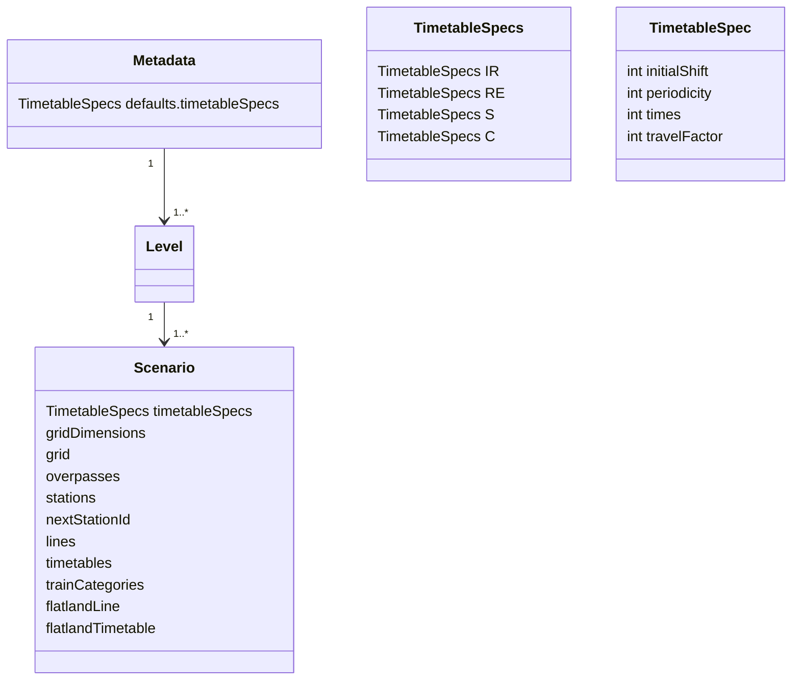
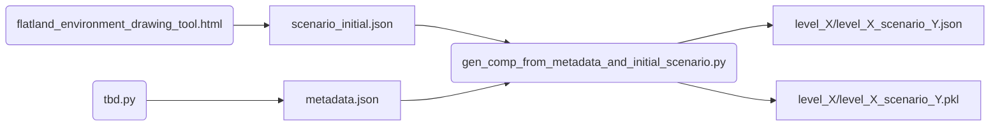
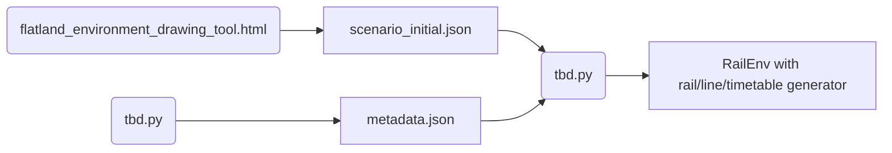

# Scenario generator

This tool helps you to create Flatland environments and generate customized scenarios.

## Data Model and Data Flow

### Glossary

| Term             | Description                                                                                                                                                                                        |
|------------------|----------------------------------------------------------------------------------------------------------------------------------------------------------------------------------------------------|
| Scenario         | Rail, lines, timetables and malfunction parameters fixed (each train has a set of stops with routing flexibility and a time window at each stop).                                                    |
| Initial Scenario | Defines timetables all starting at zero, malfunction usually empty.                                                                                                                                  |
| Metadata         | Defines tthe instatiation of the scenario from the initial scenario and timetable specs.                                                                              |
| Line             | A line is a sequence of stops with routing flexibility at intermediates and target but not initial (in strict Flatland sense, lines are agents with stops already assigned and max speeds as well) |
| Train Category   | Used to differentiate timetable specs for different train categories.                                                                                                                               |
| Timetable        | Corresponds to a Flatland agent with the stops to serve in a given time-windows (Flatland Timetable).                                                                                              |
| Scene            | A set of lines.                                                                                                                                                                                    |

### Data Model

### From Initial Scenario to Set of Scenarios

### From Initial Scenario to `RailEnv` (`reset` drawing from distribution in metadata)

## Drawing Tool

| workflow                                        |
|-------------------------------------------------|
| [`Initialize grid`](#initialize-grid)           |
| [`Draw grid-world`](#draw-grid-world)           |
| [`Create Lines`](#create-lines)                 |
| [`Define train categories`](#define-train-categories) |
| [`Create Timetables`](#create-timetables)         |
| [`Export environment`](#export-environment)     |

### Initialize grid

Choose the number of rows and columns and how large they should be displayed on the screen. You can always resize both cell size and grid dimensions.

:warning: By shrinking the size of your grid you can delete parts of it (cannot be undone)!

You can also import previously exported JSON files which include both grid and cell size. You can use the *raw data import* at the bottom to only import the
grid, overpasses or stations.

### Draw grid-world

Use the **left mouse button to draw**, the **right mouse button to delete**. You can use your mouse or keyboard to alter, rotate or flip elements, define train
stations or overpasses.

Use the arrow keys to navigate on the grid and the keyboard shortcuts listed in the tool for more efficient drawing.

:bulb: Station-cells adjacent to each other have the same station-id, i.e. belong to the same station.

### Create Lines

To create Lines click the *Lines & Timetables* button. Each Line has

- a unique **name**
- an **ordered list of stations** (can be created by clicking on the map or comma separated manual input)
- **start cell** and **end cell** (intermediate stations are identified through all corresponding cells to allow for the use of this flexibility)

Once a Line is created, you can display the shortest path lengths between the stations and the Line can be

- edited
- copied
- reversed
- deleted

### Define train categories

In order to choose what train is running your Lines you can create categories of trains whose parameters are a description of the ctegory and its **maximum speed**. There are 4 predefined train
categories.

### Create Timetables

To create Timetables click the *Lines & Timetables* button.

- give it a **name**
- select a **Line**
- select a **train class**
- choose the **travel factor** (this factor is multiplied with the length of the shortest path connecting to the subsequent station to add time flexibility)
- choose the **dwell time** [default: 2] (the dwell time is the number of time steps between the *latest arrival* and the *earliest departure* used in the
  automatic filling of the timetable)
- apply a **shift** to the whole timetable (this is mainly used when copying a Timetable to then shift the copy)

Timetables can be copied (and then shifted) within the drawing tool. However, to create scenarios with lots of shifted Timetables on the same lines, use
`generate_scenario.py` with your customized duplication function (see below).

### Export environment

Export your creation to save it or to use it when finished by clicking the *Export All (.json)* button.

You can use the *raw data import* at the bottom to only export the grid, overpasses or stations.

Click the *Flatland Download* button to download `flatland_import.py` to create the Flatland environment and save it as .pkl to then run your simulation. (If
you use `generate_scenario.py` to generate your scenario, do this before running `flatland_import.py`.)

## Generate scenario

Use the `generate_scenario.py` script to duplicate the initial Timetables to create a complete timetable:

- the **initial_shift** defines the first *earliest departure*
- the **shift** defines the shift from one Timetable to the next
- **times** defines how many times the Timetable should be created (it is technically not copied, so `times=1` results in only one Timetable)

Using this method you only need to create each unique Timetables once in the drawing tool.

:warning: To use this script without much customization, name your timetables *XY 1.1*, *XY 2.1*, etc. (e.g. *IC 1.1*, *IC 2.1*, *RE 1.1*, *RE 2.1*).